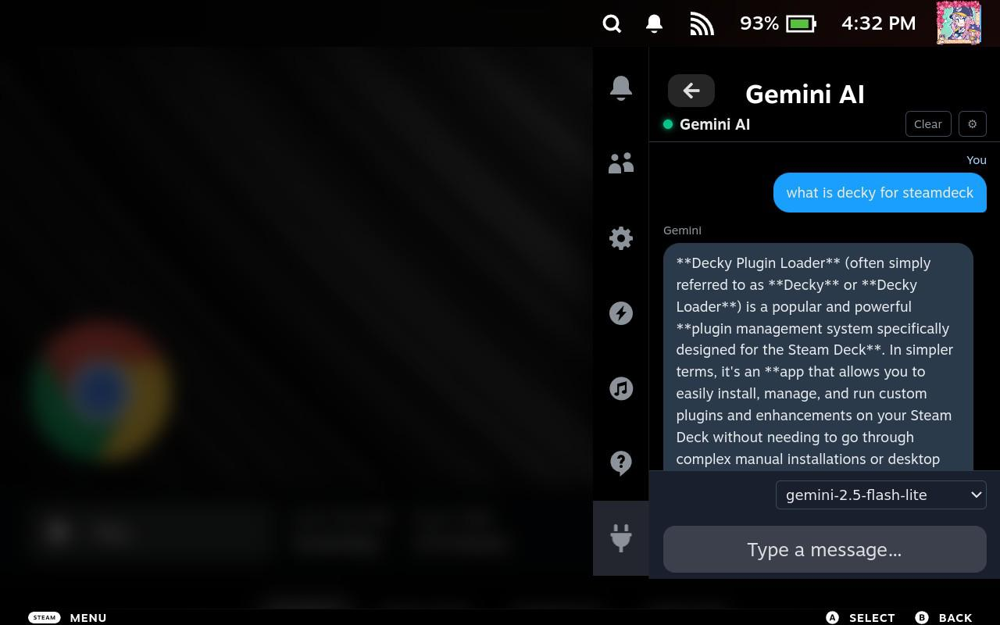

# GeminiAI — Decky Loader Plugin

Chat with Google Gemini directly from your Steam Deck's Quick Access Menu.



---

## Features

- 💬 Full chat interface with Google Gemini
- 🔄 Switch between Gemini models (gemini-2.5-flash-lite, gemini-2.5-flash, gemini-1.5-flash) via an in-chat dropdown
- 🔑 Secure API key storage on-device
- 🧹 Clear chat history anytime
- ⚙️ Change/reset API key from the Settings page

---

## Requirements

- [Decky Loader](https://github.com/SteamDeckHomebrew/decky-loader) installed on your Steam Deck
- A [Google Gemini API key](https://aistudio.google.com/apikey)

---

## Installation (Manual / Sideload)

I have included the 'node_modules' and 'dist' directories prebuilt on this repo for those who doesnt have npm installed on their machines. So you dont have to do the Build the plugin step #1 below.

1. **Build the plugin** (on a dev machine with Node.js 18+):
   ```bash
   npm install
   npm run build
   ```
   This produces a `dist/index.js` bundle.

2. **Copy the plugin folder** to your Steam Deck (needs sudo or root access):
   ```
   ~/.local/share/decky-loader/plugins/
   ```
   If you installed using homebrew, paste it inside the the plugins folder should be in
   ```
   ~/homebrew/plugins/
   ```
   The folder should contain:
   ```
      GeminiAI/
      ├── plugin.json
      ├── main.py
      ├── package.json
      └── dist/
         └── index.js
   ```

3. **Restart Decky Loader** from the Decky settings menu.

4. Open the **Quick Access Menu** (…) → find **Gemini AI**.

5. On first launch you'll be prompted for your Google Gemini API key.  
   Paste it in and press **Save & Start Chatting**.

---
## Usage Notes

To use AI API Keys, long press on the API Key text box and then select paste. Make sure your API key is copied into your clipboard.

The most reliable model that is always available is 'gemini-2.5-flash-lite' so if you're always getting problems with model availability, just use that.

---

## Development

```bash
# Install deps
npm install

# Watch mode for live rebuilds
npm run watch
```

Use the [Decky CLI](https://github.com/SteamDeckHomebrew/cli) for hot-reloading during development.

---

## Notes

- API calls are made directly from the Steam Deck to `generativelanguage.googleapis.com`.
- Your API key is stored locally in Decky's settings directory and never leaves your device.
- Default model: `gemini-2.5-flash-lite`. You can switch models using the dropdown at the bottom of the chat screen.
